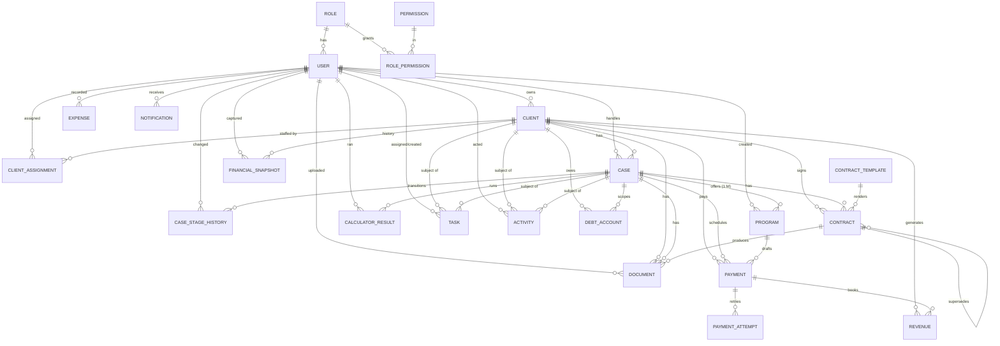

# DebtFlow CRM — Entity Relationship Diagram (V1)

> Generated from [packages/database/prisma/schema.prisma](packages/database/prisma/schema.prisma).
> Renders on GitHub / any Mermaid-aware viewer. 22 entities.

## Relationship Map (Mermaid)



## Entity Inventory

| Entity | Purpose | Key history/audit role |
|--------|---------|------------------------|
| **User** | Staff account | — |
| **Role** | One of 8 RBAC roles | — |
| **Permission** | Granular capability key | — |
| **RolePermission** | Role↔Permission join | — |
| **Client** | Debtor profile (personal/employment/financial) | current financials cached |
| **ClientAssignment** | Many staff per client (SALES/CASE_MANAGER/ACCOUNTING/SUPPORT) | — |
| **FinancialSnapshot** | Point-in-time client financials | ✅ financial history |
| **Case** | Lifecycle through 8 stages | — |
| **CaseStageHistory** | Every stage transition (from→to, by, when) | ✅ time-in-stage |
| **DebtAccount** | Per-creditor debt | — |
| **Program** | Resolution offer, **1:M** (V1/V2/V3), versioned + isActive | ✅ offer history |
| **CalculatorResult** | Immutable calculator run (inputs/outputs JSON) | ✅ calc history |
| **Payment** | ACH/manual draft, reconciliation, cached latest attempt | — |
| **PaymentAttempt** | One row per retry (status, bank return code, reason) | ✅ retry history |
| **Revenue** | Money in (source, client, payment) | dashboard |
| **Expense** | Money out (payroll/marketing/…) | dashboard |
| **Document** | S3 file, versioned, linked to client/case/contract | — |
| **ContractTemplate** | `{{variable}}` template | — |
| **Contract** | Generated contract, versioned + supersedes chain, embedded signature tracking | ✅ revision history |
| **Task** | Work item on client/case | — |
| **Notification** | Bell-icon per-user alert | — |
| **Activity** | Unified Timeline + Audit + System + Automation log | ✅ audit trail |

## Notable Design Rules

- **One role per user** (V1). Multi-role can be added later via a join without
  schema-breaking changes.
- **Age is never stored** — only `dateOfBirth`; age is computed in the app.
- **Program is 1:M per case** with `@@unique([caseId, version])`; a **partial
  unique index** (`Program_caseId_active_unique`, in the migration) enforces a
  single `isActive` program per case at the **database** level.
- **Contract is versioned** (`version` + `supersededById` self-relation,
  `@@unique([caseId, version])`) — revisions are a supersede chain, not deletes.
- **PaymentAttempt** preserves every ACH retry's bank return code + reason;
  `Payment.attemptCount`/`failureReason` are just cached latest values.
- **History entities** (`FinancialSnapshot`, `CaseStageHistory`,
  `CalculatorResult`, `PaymentAttempt`, versioned `Program`/`Contract`) exist so
  nothing is overwritten — important for compliance.
- **Activity** is the single firehose for timeline, audit, system, and
  automation events; indexed on `clientId`, `caseId`, `createdAt`.
```
